### 8.3 Использование Yandex Cloud - Наталия Проворкова
#### Kibana
###### 1. Допишите playbook: нужно сделать ещё один play, который устанавливает и настраивает kibana.
###### 2. При создании tasks рекомендую использовать модули: `get_url`, `template`, `yum`, `apt`.
###### 3. Tasks должны: скачать нужной версии дистрибутив, выполнить распаковку в выбранную директорию, сгенерировать конфигурацию с параметрами.
###### 4. Приготовьте свой собственный inventory файл `prod.yml`.
#### 5. Запустите `ansible-lint site.yml` и исправьте ошибки, если они есть.
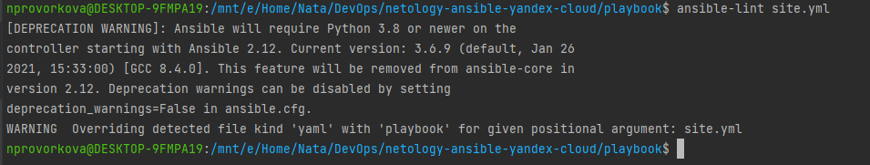
#### 6. Попробуйте запустить playbook на этом окружении с флагом `--check`.
ansible-playbook -i inventory/prod site.yml --check
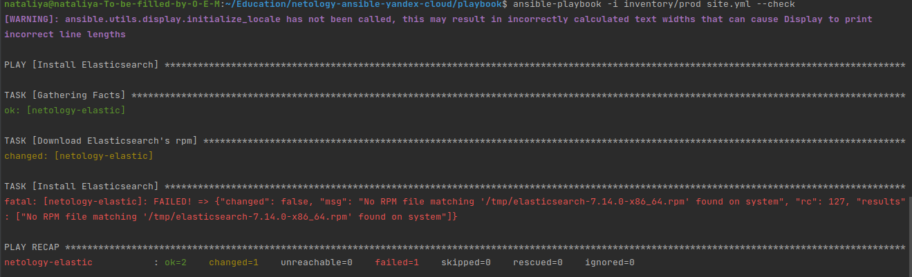
#### 7. Запустите playbook на `prod.yml` окружении с флагом `--diff`. Убедитесь, что изменения на системе произведены.
ansible-playbook -i inventory/prod site.yml --diff
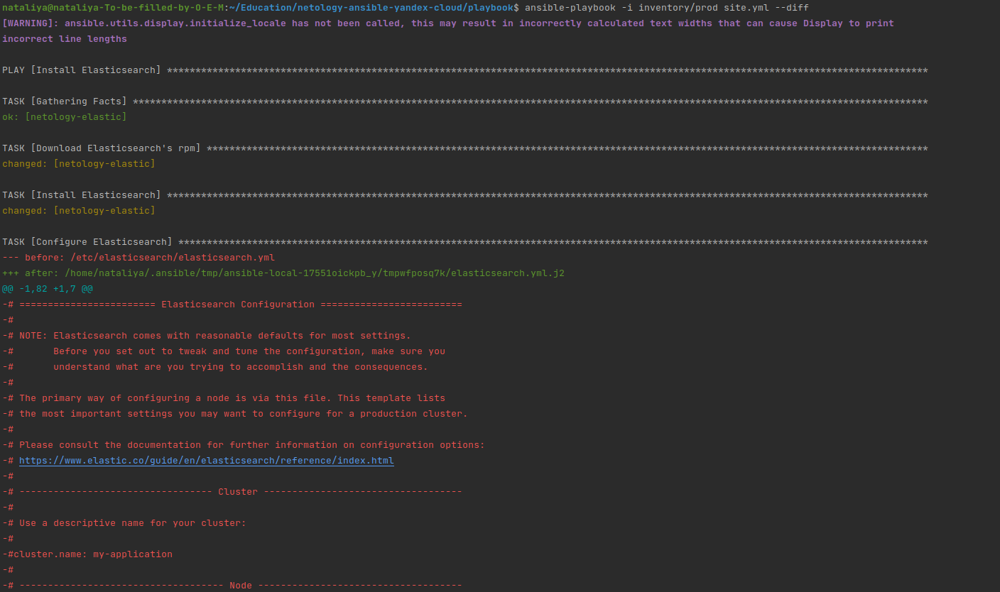
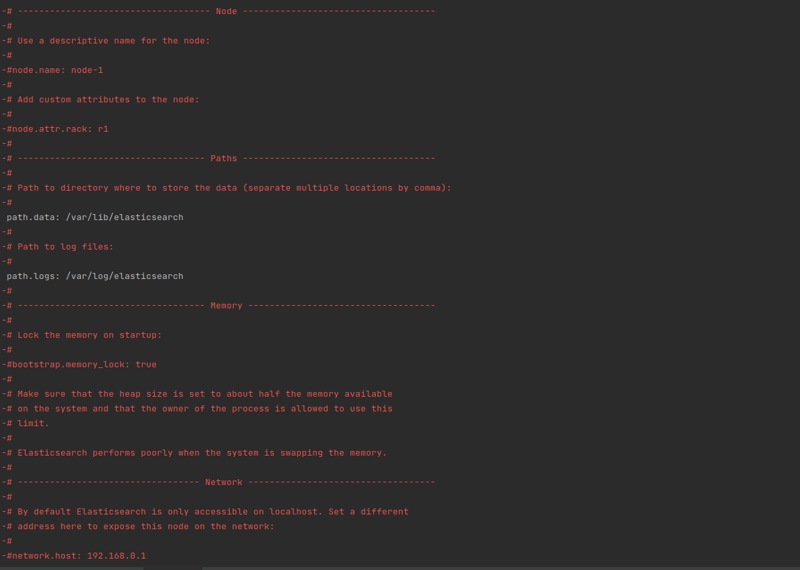
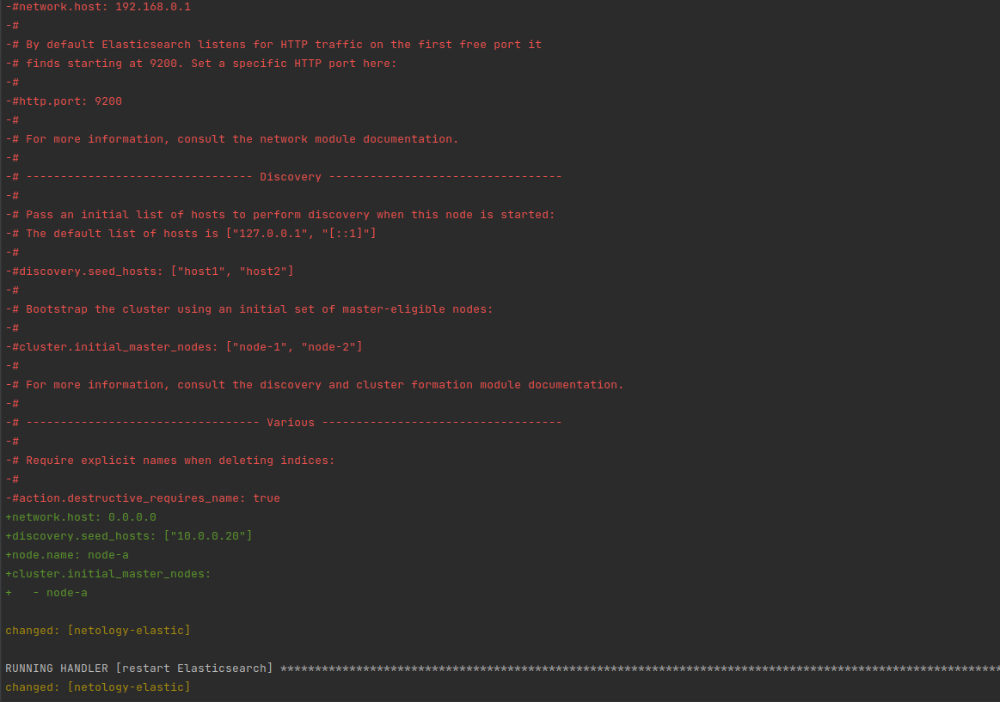
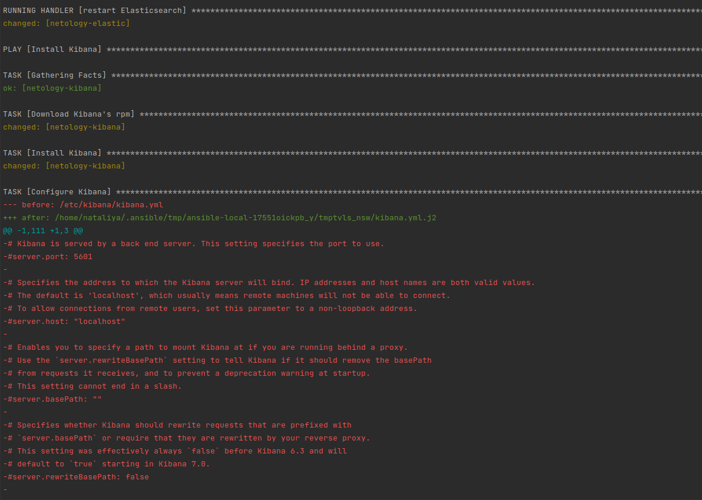
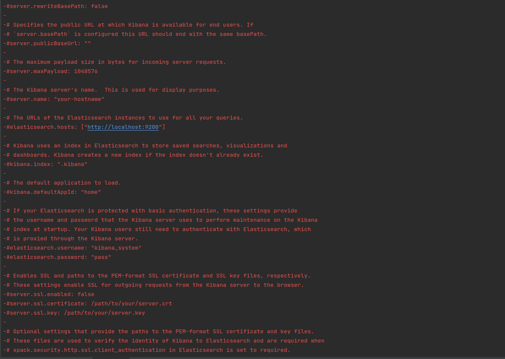
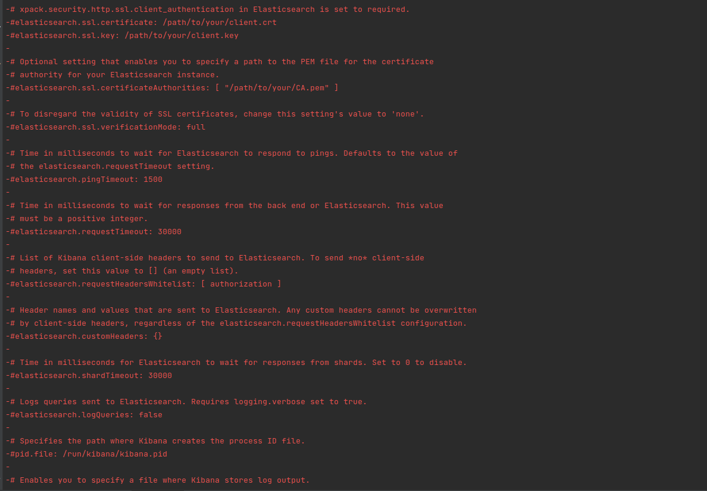
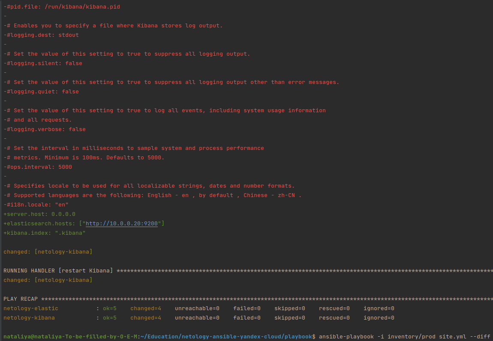
Доступность Elasticsearch:
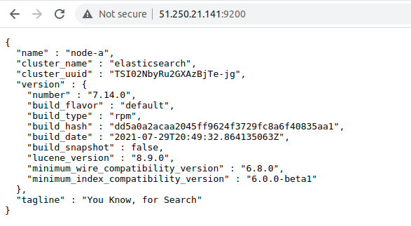
Доступность Kibana:
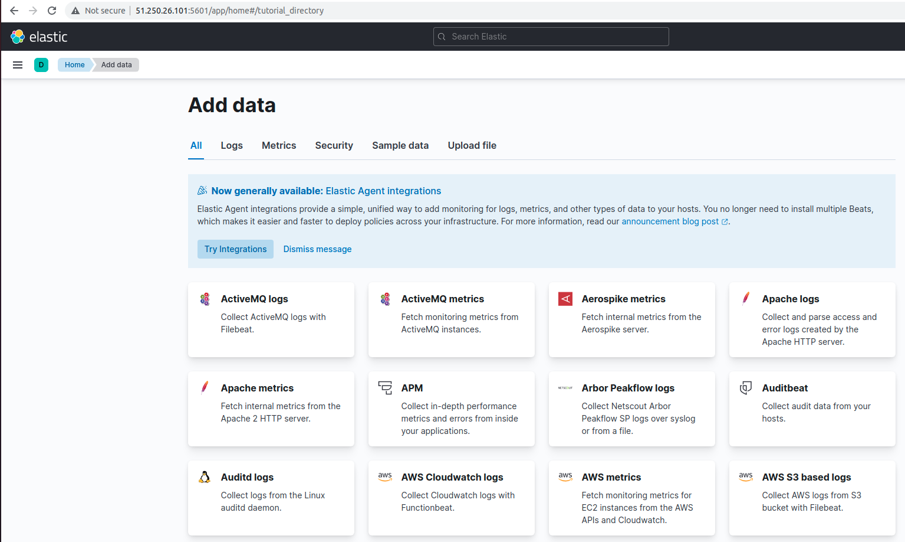
#### 8. Повторно запустите playbook с флагом `--diff` и убедитесь, что playbook идемпотентен.
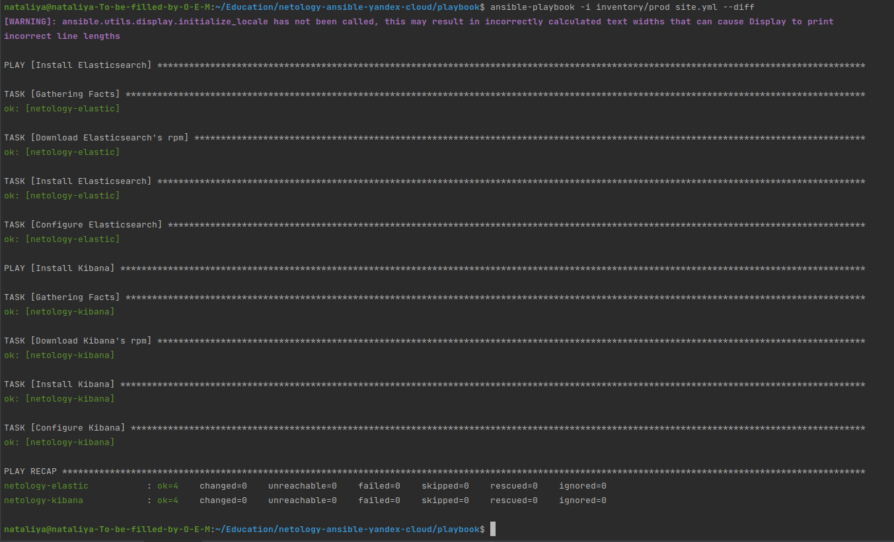
###### 9. Проделайте шаги с 1 до 8 для создания ещё одного play, который устанавливает и настраивает filebeat.
#### Filebeat
###### 1. Допишите playbook: нужно сделать ещё один play, который устанавливает и настраивает kibana.
###### 2. При создании tasks рекомендую использовать модули: `get_url`, `template`, `yum`, `apt`.
###### 3. Tasks должны: скачать нужной версии дистрибутив, выполнить распаковку в выбранную директорию, сгенерировать конфигурацию с параметрами.
###### 4. Приготовьте свой собственный inventory файл `prod.yml`.
#### 5. Запустите `ansible-lint site.yml` и исправьте ошибки, если они есть.
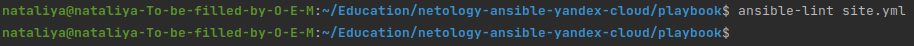
#### 6. Попробуйте запустить playbook на этом окружении с флагом `--check`.
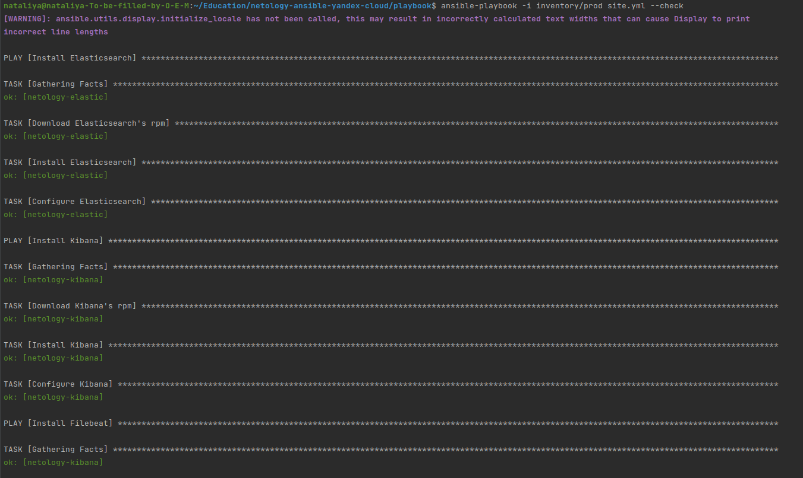
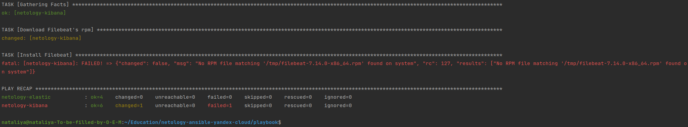
#### 7. Запустите playbook на `prod.yml` окружении с флагом `--diff`. Убедитесь, что изменения на системе произведены.

Доступность Filebeat:
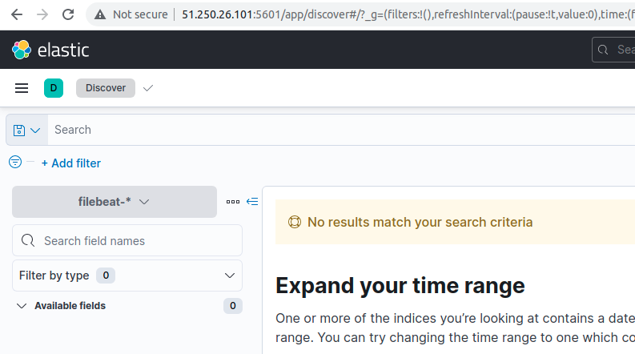
#### 8. Повторно запустите playbook с флагом `--diff` и убедитесь, что playbook идемпотентен.
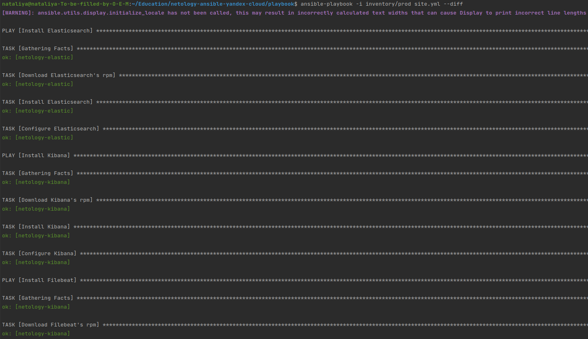
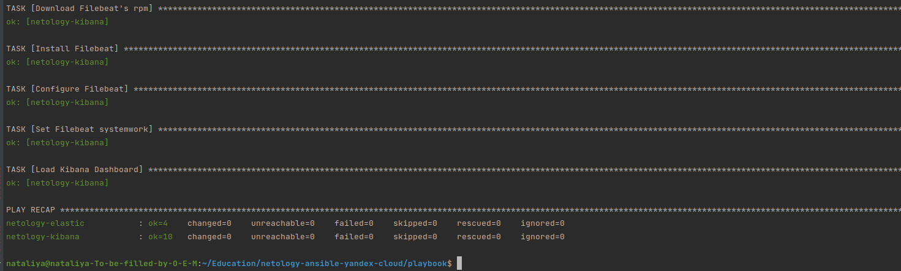
#### 10. Подготовьте README.md файл по своему playbook. В нём должно быть описано: что делает playbook, какие у него есть параметры и теги.\
Playbook
1. Устанавливает Elasticsearch:
* Скачивает Elasticsearch
* Устанавливает Elasticsearch
* Экспортирует переменные окружения Elasticsearch из шаблона
2. Устанавливает Kibana:
* Скачивает Kibana
* Устанавливает Kibana
* Экспортирует переменные окружения Kibana из шаблона
3. Устанавливает Filebeat:
* Скачивает Filebeat
* Устанавливает Filebeat
* Экспортирует переменные окружения Filebeat из шаблона
* Запускает Filebeat

Параметры Playbook:
* elk_stack_version